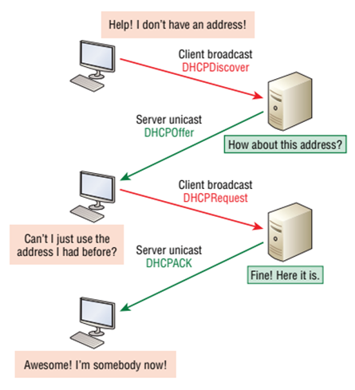

# Module 3: Application Layer Services & Common Application Layer Protocols

## Introduction

Module 3 will discuss in detail operations and features of common application layer protocols.

---

### Learning Outcomes

By the end of this module, you should be able to:

- Describe the main functions of TCP/IP application layer.  
- Identify common application layer protocols and services.  
- Describe the working procedure, benefits, and drawbacks of TELNET and SSH.  
- Explain benefits of HTTPS over HTTP.  
- Describe functionality of DNS and DHCP in networks.  
- Describe SMTP, POP, and IMAP protocols and their functionality.

---

### Key Terms and Concepts

**Asymmetric encryption**  
Secret keys come in pairs—one for encryption and another for decryption. The keys are interchangeable; if key A encrypts a message, then key B can decrypt it, and vice versa.

**Hashing**  
Hashing is a one-way function that scrambles plain text to produce a unique message digest. With a properly designed algorithm, there is no way to reverse the hashing process to reveal the original password.

**Spawn**  
To release or initiate a process.

**Symmetric encryption**  
Only one secret key is used to both encrypt and decrypt electronic information.

The **Application Layer** is the highest abstraction layer in the TCP/IP model. It provides the interfaces and protocols needed by users to interact with the network.

## TCP/IP Application Layer

The application layer is the highest abstraction layer of the TCP/IP model that provides the interfaces and protocols needed by the users. It combines the functionalities of the **session layer**, **presentation layer**, and **application layer** of the OSI model.

---

### Main Functions of the Application Layer

- Facilitates the user to use the services of the network.  
- Used to develop network-based applications.  
- Provides user services such as:
  - User login  
  - Naming network devices  
  - Formatting messages and emails  
  - File transfer  
- Concerned with error handling and recovery of the message as a whole.

---

### TCP/IP Application Layer Protocols

The diagram below shows the TCP/IP protocol suite and how its protocols relate to the TCP/IP model layers:


From the diagram, you can see the application layer supports a number of protocols.

### Main Application Layer Protocols:

- **Telnet**  
- **SSH**  
- **HTTP**  
- **HTTPS**  
- **DNS**  
- **DHCP**  
- **SMTP**  
- **FTP**  
- **POP**  
- **IMAP**

---

Next, we will discuss the operations and features of these common application layer protocols.

## TELNET

**TELNET** is an application protocol used on the Internet or local area networks to provide bidirectional, interactive, text-oriented communication using a virtual terminal connection. It transmits user data **in-band** with TELNET control information over an **8-bit byte-oriented TCP connection**.

---

### What TELNET Does

- Allows a user on a remote machine (TELNET client) to access the resources of another machine (TELNET server).
- Makes the client machine appear as though it were a terminal directly attached to the server.
- TELNET servers usually listen on **TCP Port 23**.
- **Telnet** is also the name of the client program that uses the TELNET protocol.

---

### TELNET Syntax
    telnet <hostname or IP> <port>

Example:
    telnet 192.168.1.10 23


---

## How TELNET Works

1. A user on a local machine starts the TELNET client using a command like `telnet xxx.xxx.xxx`.
2. The TELNET client initiates a **TCP connection** to the TELNET server.
3. After connection:
   - User keystrokes are sent to the TELNET server.
   - The server passes these to the **terminal server** (i.e., the OS’s interface to user input).
   - Output from the server is returned to the client and displayed on the user’s screen.
4. The TELNET server typically uses a **master-slave architecture**:
   - The master listens for incoming requests.
   - For each client, a **slave server** is spawned to handle the session.

---

## Network Virtual Terminal (NVT)

- TELNET supports diverse terminals and OSes through the concept of the **Network Virtual Terminal (NVT)**.
- Regardless of the actual terminal type, TELNET uses NVT to standardize communication.
- Characters are defined as **8-bit (1 byte)**.
- The **TELNET client translates** user input into NVT format.
- The **TELNET server translates** NVT input into a format suitable for the host OS and returns responses in NVT format.

---

## TELNET Security Concerns

- **No encryption** is provided.
- All communication, including **passwords**, is sent in **plain text**.
- **Not recommended for use in production environments** due to security vulnerabilities.

---

## Why TELNET Is Still Used

- **Simplicity**: Easy to use and understand.
- **Low overhead**: Minimal resource usage.
- Still used in **closed, trusted networks**, labs, or for legacy system access.

---

  

---

**Note**: Telnet emulates **text-mode terminals** that support procedures like displaying menus and executing commands, but it does not support GUI-based interfaces.

## Secure Shell (SSH)

**SSH (Secure Shell)** is a remote administration protocol that allows users to securely control and modify remote servers over the Internet. SSH was created as a **secure replacement for Telnet**, providing encrypted communication to prevent eavesdropping and other attacks.

---

### Key Features of SSH

- Provides **encrypted remote access**.
- Supports **authentication** of remote users.
- Allows execution of **remote shell commands**.
- Transfers input from client to host and relays output from host to client.
- SSH uses **cryptographic techniques** to secure the session.

---

### Platforms

- **Linux/macOS**: Use the built-in terminal.
- **Windows**: Use tools like:
  - **PuTTY** (popular SSH client)
  - Windows Command Prompt (with optional Telnet/SSH features enabled)

---

### SSH Command Syntax
    ssh {user}@{host}


Where:
- `{user}` = the username on the remote system (e.g., `root` for admin access)
- `{host}` = the IP address or domain of the remote machine (e.g., `192.168.1.10` or `example.com`)

### Example:
    ssh root@192.168.1.10


When you press **Enter**:
1. You'll be prompted to enter the password for the remote user.
2. Although nothing appears as you type, your input **is being registered** securely.
3. After pressing **Enter** again, if authenticated, you'll get access to a **remote terminal**.

---

## SSH on Windows

### Option 1: Built-in SSH (Windows 10+)
1. Enable the **Telnet client** or **OpenSSH client** in Windows Features (if not already enabled).
2. Open **Command Prompt** or **PowerShell** and use the same `ssh` command as in Linux/macOS.

### Option 2: Using PuTTY
1. Download and install **PuTTY**.
2. Open PuTTY and enter the **host name** or **IP address**.
3. Set **Port** to `22` (default SSH port).
4. Click **Open** to start the session and enter your credentials.

---

## SSH Encryption Technologies

SSH provides secure communication through three main cryptographic methods:

1. **Symmetric Encryption**
   - Uses a **single key** for both encryption and decryption.
   - The same shared key must be known to both client and host.

2. **Asymmetric Encryption**
   - Uses a **pair of keys**: a public key for encryption and a private key for decryption.
   - Ensures secure exchange of session keys and authentication.

3. **Hashing**
   - Converts data (like passwords) into a **fixed-size hash value**.
   - Used to ensure **data integrity** and **verify passwords** without revealing the original input.

---

## Advantages of SSH over Telnet

| Feature        | Telnet            | SSH                |
|----------------|--------------------|---------------------|
| Encryption     | ❌ None             | ✅ Yes               |
| Port           | TCP 23             | TCP 22              |
| Security       | ❌ Vulnerable       | ✅ Secure            |
| Use in production | ❌ Not recommended | ✅ Recommended        |

---

**Summary**: SSH is a secure, flexible, and widely-used protocol for accessing and managing remote systems—replacing Telnet in almost all practical scenarios.

## Hypertext Transfer Protocol (HTTP)

**HTTP (Hypertext Transfer Protocol)** is an application-layer protocol used for distributed, collaborative, hypermedia information systems. It is the **foundation of communication on the World Wide Web**, enabling web browsers and servers to exchange data.

Whenever you click a link, HTTP handles the communication between your browser (the client) and the destination server, retrieving the appropriate web content—no matter where it physically resides.

---

### Key Features of HTTP

- Facilitates **client-server communication** over the web.
- Used to **request and deliver** web content like HTML pages, images, stylesheets, scripts, etc.
- Stateless protocol: each request is independent and contains all the information needed to be understood.

---

### How HTTP Works

HTTP is a **request-response** protocol:

1. The **client** (usually a web browser) sends a request to a **web server**.
2. The server processes the request and sends back a **response** containing the requested content or an error message.

HTTP typically operates over **TCP (Transmission Control Protocol)**, most commonly on **port 80** (or port 443 for HTTPS).

---

### Common HTTP Request Methods

| Method   | Description |
|----------|-------------|
| `GET`    | Retrieves a specific resource in full (most commonly used). |
| `POST`   | Sends data to the server to create or update a resource. |
| `PUT`    | Replaces or creates a resource at a specific URI. |
| `DELETE` | Deletes the specified resource. |
| `HEAD`   | Retrieves metadata (headers) for a resource, without the body content. |
| `TRACE`  | Echoes back the received request—used for diagnostics. |
| `OPTIONS`| Lists available communication options for a resource. |
| `CONNECT`| Converts the request to a transparent TCP/IP tunnel (used for HTTPS). |
| `PATCH`  | Partially modifies a resource. |

> 🔹 **Note**: All HTTP servers support `GET` and `HEAD`. Support for other methods varies.

---

### URL Structure in HTTP

A **URL (Uniform Resource Locator)** specifies the address of a resource and follows this format:


## Internet Protocols

### Hypertext Transfer Protocol Secure (HTTPS)

**HTTPS (Hypertext Transfer Protocol Secure)** is the secure version of HTTP. It combines the traditional **HTTP protocol** with an added layer of **SSL/TLS encryption**, ensuring that all communications between a client (e.g. a browser) and a server are encrypted and secure.

While HTTPS functions similarly to HTTP at a high level, the crucial difference lies in the **secure channel** it establishes, protecting sensitive data like login credentials, personal information, and credit card details from interception and tampering.

---

### Key Benefits of HTTPS

- 🔐 **Encryption**: Prevents third parties from reading data sent between your browser and the server.
- 🧾 **Authentication**: Confirms you are communicating with the intended server (via digital certificates).
- 🛡️ **Data Integrity**: Ensures data isn’t altered during transmission.

---

### How HTTPS Works

Under the hood, HTTPS uses **SSL (Secure Sockets Layer)** or more commonly **TLS (Transport Layer Security)** to encrypt HTTP traffic.

Despite this extra security layer, clients and servers still communicate using **standard HTTP requests/responses**—but now wrapped in encryption.

> 🧠 **Interesting Fact**: Even though third parties can intercept HTTPS messages (including during the handshake), they **cannot decrypt** the content, thanks to robust cryptographic techniques.

---

### SSL/TLS Encryption Goals

The SSL/TLS layer serves two primary purposes:

1. ✅ **Authentication**  
   Verifies that the client is truly communicating with the intended server (via a certificate authority).

2. 🔐 **Confidentiality**  
   Ensures only the server can read what the client sends and vice versa, preventing eavesdropping or tampering.

---

### HTTPS Connection Setup: The SSL/TLS Handshake

Before secure communication begins, an **SSL/TLS handshake** occurs to establish a shared encryption strategy between client and server.

#### 🔄 Goals of the Handshake

- Authenticate the server (and optionally the client).
- Agree on a **cipher suite**—a set of algorithms used for encryption, key exchange, and message authentication.
- Generate or exchange **session keys** for encrypting the actual data.

---

### 🔐 TLS Handshake: 3 Main Phases

#### 1. Hello Phase
- The client sends a "ClientHello" message, proposing:
  - Supported TLS versions
  - Supported cipher suites
  - A random number (used later in key generation)
- The server responds with a "ServerHello", selecting:
  - TLS version
  - Cipher suite
  - Its own random number

#### 2. Certificate Exchange
- The server sends its **digital certificate**, issued by a trusted Certificate Authority (CA).
- The client verifies the server certificate using the CA's public key.

#### 3. Key Exchange
- Both parties use their random numbers and the agreed key exchange method (e.g. RSA or Diffie-Hellman) to derive the **session key**.
- This session key is used for **symmetric encryption** of all subsequent messages.

Once the handshake is complete, both the server and client can securely exchange data using the chosen encryption and session key.

---

### Summary

HTTPS is essential for secure web browsing. It protects users from:
- Data breaches
- Man-in-the-middle attacks
- Credential theft

By integrating encryption (TLS), authentication (certificates), and integrity checks, HTTPS provides a **safe and private communication channel** on the internet.

> 🌍 Today, HTTPS is considered a **best practice and default standard** for all websites handling sensitive data.

## Domain Name System (DNS)

The **Domain Name System (DNS)** is a critical internet service that **resolves hostnames to IP addresses**. It allows users to access websites using human-readable names (like `www.lammle.com`) instead of numeric IP addresses.

---

### Why DNS Is Necessary

Imagine you want to visit `www.lammle.com`. If you already knew the server’s IP address, you could enter it directly in your browser. But in most cases—like when accessing `onefootball.com`—you won’t know the IP. And it’s impractical to memorize the IPs of all websites.

That’s where DNS comes in:  
🧭 It acts like the **internet's phonebook**, mapping domain names to IP addresses so users can access resources using familiar names.


---

### How DNS Works

1. You type a domain name (e.g., `onefootball.com`) into your browser.
2. The browser hands the request to the **Application layer**.
3. The system sends a **UDP request** to the configured DNS server.
4. If the DNS server has the domain cached, it responds with the correct IP.
5. If not, it **forwards a TCP request** to a **root DNS server**.
6. The root server helps route the query until a server with the correct answer is found.
7. The IP address is returned to the original device, which can now contact the web server.

---

> 🧠 **Note**: DNS typically uses **UDP** for requests due to its speed, but will switch to **TCP** for larger responses or advanced resolution processes.

---

### Fully Qualified Domain Name (FQDN)

DNS resolves **Fully Qualified Domain Names (FQDNs)**—names that unambiguously identify a resource on the internet.

Examples:
- `www.lammle.com`
- `todd.lammle.com`

An FQDN contains:
- **Hostname** (e.g., `www`)
- **Domain name** (e.g., `lammle.com`)
- Optionally, **subdomains** (e.g., `todd` in `todd.lammle.com`)

---

### DNS Suffixes and Shortcuts

If you only enter a hostname like `todd`, your device may automatically **append a DNS suffix** such as `.lammle.com` to form the full domain name `todd.lammle.com`.

- On a **Cisco router**, use:

```bash
ip domain-name lammle.com
```

to set this behavior.

Without this configuration, you must enter the full FQDN to resolve the name.

### Dynamic Host Configuration Protocol (DHCP)

The **Dynamic Host Configuration Protocol (DHCP)** is a network protocol used to **automatically assign IP addresses and other network configuration details to client devices** on a network. It simplifies administrative tasks and scales well from small to large network environments.

---

### Why DHCP Is Important

Without DHCP, every IP address on a network would have to be **manually configured**. DHCP automates this process, helping to prevent:
- IP conflicts
- Misconfigured settings
- Excessive administrative overhead

Many devices, including **Cisco routers**, can act as DHCP servers.

---

### What DHCP Provides

A DHCP server typically supplies the following information to clients:

- ✅ **IP Address** – Unique address for the host
- 🧮 **Subnet Mask** – Defines the host’s subnet
- 🌐 **Default Gateway** – IP of the router to reach other networks
- 🔤 **Domain Name** – Used for DNS suffixing
- 🔍 **DNS Server Address** – Resolves domain names
- 📦 **WINS Server Address** – For legacy name resolution (rarely used today)

---

### DHCP Client-Server Process

The client-server interaction in DHCP is based on a **four-step process**, known as **DORA**:

1. **Discover**  
   The DHCP client broadcasts a `DHCP Discover` message to locate available DHCP servers.  
   - Protocol: **UDP**
   - Port: **67 (server), 68 (client)**

2. **Offer**  
   The DHCP server responds with a `DHCP Offer` message containing proposed IP configuration details.  
   - Sent via **unicast** directly to the client’s MAC address.

3. **Request**  
   The client broadcasts a `DHCP Request` message, indicating that it wants to accept the offered IP address.

4. **Acknowledgment**  
   The server responds with a unicast `DHCP Acknowledgment (ACK)` message, finalizing the lease.




---

### Summary

DHCP streamlines IP management by dynamically assigning addresses and related settings. The protocol is essential in modern networks where scalability, automation, and centralized control are key.

> 🧠 **Tip**: DHCP leases can be temporary, allowing devices to reuse or rotate IP addresses over time.

## Simple Mail Transfer Protocol (SMTP)

SMTP is a **text-based, connection-oriented protocol** used to send email between servers over **TCP port 25**. An SMTP client (the sender's server) communicates with an SMTP server (the receiver's server) by issuing commands like `HELO`, `MAIL FROM`, `RCPT TO`, and `DATA` to transfer messages.

- SMTP governs **how email is pushed from the sender's mail server to the recipient's mail server**.
- It uses a **command-response model**, and the session includes handshaking, recipient identification, message transfer, and session termination.
- Example: When Bob (Gmail) sends an email to Alice (Yahoo), Gmail’s server acts as the SMTP client, and Yahoo’s server as the SMTP server, facilitating the message delivery.

SMTP handles **sending** only; receiving is typically done via **IMAP or POP3**.


## Internet Message Access Protocol (IMAP)

IMAP lets you access and manage your email directly on the mail server from any device. Emails remain on the server and are only downloaded when you open them, allowing you to check your mail quickly and from multiple devices without storing messages locally.

## Post Office Protocol version 3 (POP3)

POP3 downloads all new emails from the server to a single device and then deletes them from the server. This means emails are only accessible on that device. Sent mail is stored locally, not on the server. Unlike IMAP, POP3 is less suitable for accessing email from multiple devices.

## Example of SMTP & IMAP Working Together

When you send an email, both SMTP and IMAP are involved:

1. Your email client (e.g., Gmail, Outlook) uses **SMTP** to send the message from your device to your email server.
2. The email server then uses **SMTP** to forward the message to the recipient’s email server.
3. After the recipient’s server confirms successful delivery (250 OK), the recipient’s email client uses **IMAP** to fetch the message and place it in their inbox.

This combination allows smooth sending and receiving of emails across different devices.

