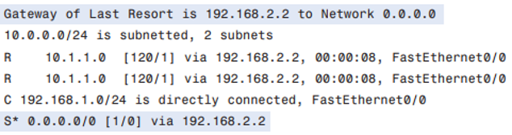

# Module 11: Network Layer Protocols and Concepts of Routing

## Introduction
This module explores Network Layer protocols and core routing concepts, concluding with a practical network simulation using Cisco Packet Tracer.

### Learning Objectives
By the end of this module, you will be able to:
- Explain the functions of the Network Layer.
- Interpret various Network Layer protocols.
- Distinguish IPv4 characteristics and identify fields in IPv4 packet headers.
- Understand host grouping and its importance.
- Describe how IP packets traverse networks.
- Explain routing fundamentals and compare routing protocols.
- Execute a network simulation using Packet Tracer.

### Key Terms and Concepts

- **Overhead:** Additional information included in a packet beyond the actual data to support delivery and management.
- **Next-hop:** The next router a data packet is sent to on its path to the final destination.
- **Metric:** A cost value used by routing protocols to determine the most efficient path through a network.

## Network Layer

The **Network Layer** is the third layer of the OSI model. It receives data from the Transport Layer and encapsulates it into **packets** for delivery across multiple networks. Its primary role is to ensure reliable **end-to-end delivery** of data from the source to the destination.

### Key Functions

- **Routing:** Determines the best path for data packets to travel across interconnected networks. Routing decisions can be based on static tables or dynamic updates.
- **Logical Addressing:** Assigns IP addresses to distinguish between source and destination systems. While the Data Link Layer handles local (physical) addressing, the Network Layer manages global addressing.
- **Congestion Control:** Implements mechanisms to manage and avoid network congestion.
- **Performance Handling:** Addresses transmission issues like delays, jitter, and timing.

The Network Layer prepares packets for delivery by:
1. **Addressing** the packet correctly.
2. **Encapsulating** it with the required headers.
3. **Routing** it through connected networks.
4. **Decapsulating** it at the destination for processing.

> 📌 The Network Layer makes it possible for data to traverse diverse networks and reach the correct destination reliably.

## Host to Host Communication

At the **Network Layer**, data is received from the **Transport Layer** in the form of Protocol Data Units (PDUs). These PDUs are further processed using protocols (like IP) to enable communication between hosts, especially those on different networks.

Network layer protocols:
- Add **addressing and routing information**.
- Define how a PDU is **packaged (encapsulation)** and **delivered**.
- Minimize transmission **overhead**.

### Four Main Tasks of the Network Layer

#### 1. Addressing
Each device must have a **unique IP address**:
- **Source IP**: The sender's IP address.
- **Destination IP**: The receiver's IP address.

#### 2. Encapsulation
PDUs are encapsulated with an **IP header** that includes addressing and identification bits.

> 📌 When a Layer 4 PDU is encapsulated at Layer 3, it becomes a **packet**.

 

#### 3. Routing
Routers use the destination IP to determine the **best path** to forward packets. This process may involve several **hops** across multiple routers.

- Each router examines the packet header.
- The packet is forwarded based on routing information.
- The data itself and its IP header remain **unchanged** until the final destination.

#### 4. Decapsulation
At each hop:
- The Layer 2 (data link) frame is **decapsulated**.
- The IP packet is passed to the **network layer**.

At the **final destination**:
- The network layer verifies the destination IP.
- The packet is decapsulated and passed up to the **transport layer** for application-level processing.
- The packet is then **discarded** as its purpose has been fulfilled.

> 🔁 **Encapsulation** and **decapsulation** happen at multiple OSI layers throughout a packet’s journey.

## Network Layer Protocols, Internet Protocol (IP), and IPv4

### Network Layer Protocols

While **IP** is the most common network layer protocol, there are others, each with unique features. In the past, many protocols were **proprietary**, meaning devices from different vendors couldn’t communicate. The introduction of **open-source IPv4** allowed interoperability between various devices and manufacturers.

**Common Network Layer Protocols:**

---

### Internet Protocol (IP)

IP is a **low-overhead** protocol. Its core job is simple: **deliver packets** from source to destination across interconnected networks. It does **not track or manage** the flow of packets — those tasks belong to upper-layer protocols like TCP.

#### IPv4 and IPv6

- **IPv4**: The most widely used network layer protocol today.
- **IPv6**: The successor to IPv4, designed to address IPv4’s limitations (e.g., address exhaustion). It is being adopted gradually and will eventually operate **alongside or replace** IPv4.

---

### IPv4

#### Key Characteristics of IPv4:

- **Connectionless**
- **Best Effort (Unreliable)**
- **Media Independent**

Let’s explore each of these:

---

#### 🔌 Connectionless

Unlike TCP, which is **connection-oriented**, IPv4 is **connectionless**. This means:

- IP **does not establish a connection** before sending packets.
- It **doesn’t notify** the receiver in advance.
- Packets are sent independently, without acknowledgment.
- **Efficiency** is prioritized: IP headers are smaller and faster to process.

IP and TCP work well together in the **TCP/IP model**:  
- TCP handles reliability (e.g., retransmissions).
- IP handles fast, efficient delivery.

---

#### 📦 Best Effort (Unreliable)

IP offers **no delivery guarantees**:
- No confirmation of arrival.
- No automatic retransmission of lost packets.

But this design choice improves:
- **Speed**
- **Scalability**
- **Simplicity**

Upper layers (e.g., TCP) can compensate if reliability is required.

---

#### 🌐 Media Independent

IPv4 works **regardless of the transmission medium**:
- Ethernet
- Wi-Fi
- Fiber
- Satellite, etc.

The **structure of IP packets remains unchanged**, no matter how the data is carried.

> However, the size of packets may be affected by the **Maximum Transmission Unit (MTU)** of the media.

---

#### 🧩 Fragmentation

If a packet exceeds the MTU of a network segment:
- The router **fragments** the packet.
- Each fragment is sent separately.
- The receiving device **reassembles** the packet.

This ensures that large packets can traverse networks with varying MTU requirements.

## IPv4 Packet: Packaging the Transport Layer PDU and IPv4 Packet Header

### IPv4 Packet: Packaging the Transport Layer PDU

#### Purpose of Encapsulation

- IPv4 encapsulates the **transport layer PDU** (TCP segment or UDP datagram) for delivery across networks.
- This encapsulation:
  - Happens at the **network layer** of the OSI model.
  - **Remains unchanged** as the packet travels from the source to the destination.
- Benefits of layered encapsulation:
  - **Layer independence** – layers can evolve separately.
  - **Scalability** – transport layer segments can be packaged by IPv4, IPv6, etc.

#### Role of Routers

- Routers use only the **IPv4 header** to forward packets.
- The **payload (transport layer PDU)** is **not modified** by the network layer.
- Multiple network layer protocols (e.g., IPv4 and IPv6) can operate simultaneously in a network.

---

### IPv4 Packet Header

The **IPv4 header** contains instructions for handling and delivering the packet. It includes:

#### Key Fields

| Field                    | Description |
|--------------------------|-------------|
| **Version**              | Specifies the IP version (e.g., `4` for IPv4). |
| **Internet Header Length (IHL)** | Length of the header in 32-bit words (min = 5). |
| **Packet Length**        | Total packet size (header + data); max = 65,535 bytes. |
| **Identification**       | Used by the source to label fragments for reassembly. |
| **Flags & Fragment Offset** | Used to manage and reconstruct fragmented packets. |
| **Time to Live (TTL)**   | Maximum number of hops; decremented by 1 at each router. Packet is discarded when TTL = 0. |
| **Protocol**             | Identifies the upper-layer protocol (e.g., TCP = 6, UDP = 17, ICMP = 1). |
| **Header Checksum**      | Validates the header’s integrity. Recalculated at every hop due to TTL changes. |
| **Source IP Address**    | 32-bit address of the sender. |
| **Destination IP Address** | 32-bit address of the receiver. |
| **Type of Service (ToS)** / **DSCP** | Specifies QoS preferences (e.g., priority for voice packets). |
| **Options**              | Rarely used; allows special routing instructions. |
| **Padding**              | Ensures the header ends on a 32-bit boundary. |

---

### IPv4 Characteristics

- **Connectionless** – no session setup required before data is sent.
- **Best-effort delivery** – no guarantees; higher layers (e.g., TCP) handle reliability.
- **Media independent** – works across any physical layer technology.
- **Fragmentation support** – routers may fragment large packets; destination host reassembles.

## Networks: Dividing Hosts into Groups

Networks are communities of computers and other hosts. Computer communities are similar to human communities in that as they grow, they become more complex, and at some point, dividing the large networks into smaller, more manageable groups can make sense. As networks grow and divide, hosts still need to find each other to communicate. One of the major roles of the network layer is to provide a mechanism for addressing hosts in a way that allows all member hosts to find each other. As the number of hosts on the network grows, more planning is required to address the network so that it can be managed efficiently.

### Creating Common Groups

A large computer network can be separated into **internetworks**. Departments and groups that share computers and servers are good candidates for dividing from the large network into a common subnetwork, or **subnet**. Membership in a subnet requires following the rules of communication provided by the TCP/IP protocols.

The early technology for computer network communication was designed for workgroups that were close together. As networking technology evolved, the nature of the workgroups began to change. Now, network members can be grouped not just by physical attributes, but by abstract attributes such as **purpose** and **ownership**.

### Grouping Hosts Geographically

Grouping network hosts **geographically** is an economical way to improve communications by reducing overhead for the users—especially if most of their communication stays in the neighborhood. When communication leaves the subnet, it can be subject to external bandwidth issues.

### Grouping Hosts for a Specific Purpose

People on a large network will likely use computers for many different reasons. The tools people use for work are increasingly software-based and require ever-increasing amounts of computing power to perform work tasks. These tasks may be clerical, design, educational, administrative, or commercial. Each purpose can have specialized software that consumes substantial resources.

Whatever the purpose, a network must provide sufficient resources to allow people to work. It can make sense for a network manager to divide a network by **purpose** rather than **geography** so that people sharing a common purpose are also sharing common resources.

For example, a business may employ salespersons who only log in once a day to record transactions (minimal traffic), while the art department requires heavy computing resources. In this case, it's best to create separate networks for each group.

### Grouping Hosts for Ownership

Ownership of (and access to) information is another way to group users. Grouping by purpose and geography focuses on efficiency and reduced overhead. In an **ownership group**, the main concern is **security**.

In a large network, it's harder to define and limit access and responsibilities. Dividing hosts into separate networks creates **boundaries** for enforcing security and managing access.

In the previous example, networks were grouped by function. In the following case, corporate records and the public website are kept separate because security needs override location or function.

---

## Reasons for Separating Hosts into Networks

As communities and networks grow larger, they present challenges that can be addressed by dividing the network into smaller, interconnected subnetworks. Some common issues include:

- Performance degradation  
- Security issues  
- Address management

### Performance

Hosts on a network are designed to broadcast information about themselves to others. A **broadcast** is a message sent to all other hosts, often to announce presence or request information.

While broadcasts are useful, more users mean more broadcasts, which consume bandwidth and degrade performance. Because broadcasts do not travel beyond the network boundary, the network is called a **broadcast domain**.

**Smaller networks = smaller broadcast domains = better performance**.

### Security

The original Internet was a small network of trusted users. Today’s Internet includes billions of users, devices, and systems. Security is now a primary concern.

Organizations isolate themselves from the larger Internet and shield their devices from public access. This improves their ability to protect sensitive systems and data.

#### Internal Security

A large organization can divide its network into segments (e.g., administrative, research, student) to control access internally. This approach helps protect user privacy and organizational resources.

#### Perimeter Security

Security between networks is controlled at the **perimeter** by devices like **routers** or **firewalls**. These can be configured to allow only known and trusted users or data.

### Address Management and Hierarchical Addressing

A group of hosts on a network can communicate internally. To reach outside hosts, they need a **gateway router**—a key point for sending and receiving external data.

IP addresses are split into:

- **Network portion** – guides routers to the destination network
- **Host portion** – identifies the specific device within the destination network

This addressing scheme is **hierarchical**: general → specific.

---

## Device Parameters and IP Packets

### Device Parameters: Supporting Communication Outside the Network

- Communication within a network (subnet) happens **without a network layer device**.
- When a host communicates **outside the local network**, a **router acts as a gateway** and chooses the path for the packet.
- Each host has a **default gateway address** configured.
- The default gateway is the address of a **router interface** connected to the same network as the host.
- The router interface acts as a host on the local network, so the **host IP address and default gateway address must be on the same network**.
- Default gateways are members of their own local networks.

### IP Packets: Carrying Data End to End

- The network layer’s role is to transfer data from the **source host** to the **destination host**.
- During encapsulation at the source, an **IP packet** is constructed at Layer 3 to carry the Layer 4 PDU.
- If the destination host is on the **same network**, the packet is delivered directly without using a router.
- If the destination is on a **different network**, the packet may traverse **many networks and routers**.
- The IP packet header information is used at each hop to make forwarding decisions.
- The packet remains **intact throughout the entire journey**.
- For inter-network communication, the local network delivers the packet to the **gateway router**.
- The router examines the **network portion** of the destination IP address and forwards the packet accordingly.
- If the destination network is directly connected, the packet is forwarded directly to the host.
- Otherwise, the packet is forwarded to the **next-hop router**.
- The forwarding process continues through **multiple routers (hops)** until the packet reaches the destination.

## Gateway and Route

### Gateway: The Way Out of the Network

- The **gateway**, also known as the **default gateway**, is needed to send a packet out of the local network.
- If the **network portion** of the destination address differs from the originating host’s network, the packet must be routed outside the original network.
- To do this, the packet is sent to the **gateway**, which is a router interface connected to the local network.
- The gateway interface has a network layer address that **matches the network address of the hosts**.
- Hosts are configured to recognize this address as the gateway.

#### Default Gateway

- The default gateway is configured on a host.
- On a Windows computer, the **Internet Protocol (TCP/IP) Properties** tools are used to enter the default gateway IPv4 address.
- Both the host IPv4 address and the gateway address must share the **same network (and subnet, if used)** portion of their addresses.
- *Figure 13* depicts the Windows TCP/IP Properties configuration.

---

### No Packet Can Be Forwarded Without a Route

- Whether a packet originates in a host or is forwarded by an intermediary device, the device **must have a route** to know where to forward the packet.
- A host either forwards a packet to a host on the local network or to the gateway.
- The host must have routes that represent these destinations.

- A router makes a forwarding decision for each packet arriving at the gateway interface — this process is called **routing**.
- To forward a packet, the router requires a route to the destination network.
- If no route exists, the packet **cannot be forwarded**.
- The destination network may be many hops away.
- The route only indicates the **next-hop router**, not the final destination.
- Routing maps the destination network address to the next hop, and the packet is forwarded accordingly.

---

### Confirming the Gateway and Route

An easy way to check the host IP address and default gateway on a Windows computer is by using the `ipconfig` command:

1. Open the command-prompt window by clicking the Windows Start button in the lower-left corner.
2. Choose the **Run** icon.
3. In the text box, type `cmd` and press Enter.
4. In the command prompt window (`c:\Windows\system32\cmd.exe`), type `ipconfig` and press Enter.
5. The Windows IP configuration will display the IP address, subnet mask, and default gateway addresses.

---

### Route: A Path to a Network

- A route for packets to remote destinations is added using the **default gateway address** as the next hop.
- Hosts can have routes manually added, but this is uncommon.
- Routers add routes for connected networks to their **routing table**.
- When a router interface is configured with an IP address and subnet mask, it becomes part of that network.
- The routing table includes directly connected networks.
- All other routes must be configured manually or learned via routing protocols.
- The routing table stores information about **connected** and **remote** networks.
  - **Connected networks**: directly attached to router interfaces (gateways for hosts).
  - **Remote networks**: not directly connected; routes learned or configured.
  
#### Routes in a Routing Table Have Three Main Features:
- Destination network
- Next-hop
- Metric

- The router matches the destination address in a packet with the destination network in the routing table and forwards the packet to the next-hop router.
- If multiple routes exist to the same destination, the **metric** decides the best route.

---

- Packets cannot be forwarded without a route.
- If no matching route exists, the packet is dropped.
- Routes may be connected routes or routes to remote networks.
- Routers can use a **default route** when no other route matches the destination network.

## Host Routing Table and Routing

### Host Routing Table

Hosts require a **local routing table** to ensure that network layer packets are directed to the correct destination network. Unlike the routing table in a router, which contains both local and remote routes, the local table of the host typically contains:

- Its **direct connection(s)** (hosts can belong to more than one local network)
- Its own **default route** to the gateway

Configuring the **default gateway address** on the host creates the local default route. Without a default gateway or route, packets destined outside the network will be dropped.

*Figure 17* shows a simple network for the host routing table.

> The routing table of a computer host can be examined at the Windows command line by issuing the `netstat –r` or the `route print` command.  
> Note that the host (`192.168.1.2`) serves as its own gateway to its own network (`192.168.1.0`) and has a default gateway for destinations outside the network pointing to the router interface (`192.168.1.254`).

---

---

#### Steps to Display a Local Routing Table on a Host

1. Open the command-prompt window by clicking the Windows Start button in the lower-left corner of the desktop.  
2. Choose the **Run** icon.  
3. In the text box, type `cmd` and click the **OK** button or press **Enter**.  
4. In the command prompt window (`c:\Windows\system32\cmd.exe`), type `route print` or `netstat -r` and press **Enter**.  
5. The routing table listing all known routes on the host will be displayed.

---

---

When a host creates packets, it uses the routes it knows to forward them to the **locally connected destination**. These local network packets are delivered on the local route within the network **without using a router**.

- No packet is forwarded without a route.
- Whether originating in a host or forwarded by an intermediary router, the device must have a route to identify which interface will forward the packet.
- A host must either forward a packet to another host on the local network or to the gateway, as appropriate.

---

### Routing

Routing is the process a router performs when making forwarding decisions for each packet arriving at the gateway interface.

- To forward a packet to a destination network, the router requires a **route to that network**.
- If no route exists, the packet will be forwarded to a **default gateway**.
- If no default gateway is configured, the packet **cannot be forwarded**.
- The destination network may be several hops away.
- If the router has an entry for the network in its routing table, it indicates only the **next-hop router**, not the entire route.
- The routing table maps the destination network address to the next hop and forwards the packet accordingly.

*Figure 19* depicts a portion of a local router’s routing table.

---

## Destination Network and Next Hop

### Destination Network

For a router to efficiently forward a packet to a destination network, it must have information about that route in its **routing table**. However, with millions of possible routes on the Internet, it’s unrealistic to expect any one router to know them all.

---

#### Routing Table Entries

- The **route** or destination network in a routing table entry represents:
  - A **range of host addresses**
  - Sometimes a **range of network and host addresses**

Due to the hierarchical nature of Layer 3 addressing:
- One route entry may refer to a large, general network.
- Another may refer to a **specific subnet** of that same network.

> When forwarding a packet, the router will always select the **most specific matching route** it knows.

If a subnet is **not** in the routing table, but a **larger network** containing the subnet **is**, the packet is forwarded to the next-hop for the larger network. That next-hop router is then responsible for further delivery.

---

#### Example

If a packet arrives at the router with the destination address `10.1.1.55`, the router will search for the most specific route in the following order:

1. `10.1.1.0`
2. `10.1.0.0`
3. `10.0.0.0`
4. `0.0.0.0` (default route, if configured)
5. **Dropped** (if no match is found)

> In this example, if the `10.1.1.0` network is known via `192.168.2.2`, the packet is forwarded out the **FastEthernet 0/0** interface.

---

---

### Default Route

The **default route** is the fallback route used when no specific match for the destination address exists in the routing table.

- In IPv4, the **default route** is represented by: `0.0.0.0`
- This is also referred to as the **gateway of last resort**

> Packets that do **not match any more specific routes** are forwarded to the **next-hop router** for the default route.

---

---

### Next Hop: Where the Packet Goes Next

The **next hop** is the **IP address of the next device** (usually a router) that will process and forward the packet.

- For a **host**, the next hop is the IP address of its **default gateway**.
- For a **router**, the next hop is the IP address of the **next router** in the path.

As each packet arrives:
1. The router **examines the destination IP address**
2. **Compares it** to its routing table entries
3. If a matching route is found:
   - The router forwards the packet **out the interface** that leads to the **next-hop router**

---

> Some routes may have **multiple next hops**, indicating **multiple paths** to the same destination network.  
> These are called **parallel routes** and can be used for load balancing or redundancy.

## 📦 Packet Forwarding and Routing Processes

---

### 🔄 Packet Forwarding: How a Packet Moves

At each hop (router):

1. **Layer 2 encapsulation is removed** to access the Layer 3 IP packet.
2. **Destination IP address** is examined.
3. **Routing table is checked** for the best match.
4. **Router decides to**:
   - ✅ **Forward the packet** (directly or via a next hop)
   - 🛣️ **Use the default route** (0.0.0.0 if no better match)
   - ❌ **Drop the packet** (if no route and no default)

#### 📦 Packet Scenarios

- **Scenario A: Forwarding to a known network**
  - If **local**: Send directly to the host on attached interface.
  - If **remote**: Encapsulate and forward to the next-hop router.

- **Scenario B: Using the default route**
  - Packet goes to a fallback next hop (if configured).

- **Scenario C: Dropping the packet**
  - If no match at all and no default route → **drop the packet**.
  - IP does *not* notify the sender by default (ICMP may report it).

---

### 📚 Routing: How the Router Learns Where to Send

Routers must build and maintain **routing tables**. There are two main methods:

#### 🔧 Static Routing

- Manually configured by an administrator.

##### Pros:
- Reliable
- No bandwidth or CPU overhead

##### Cons:
- No automatic updates
- High administrative effort
- Doesn’t scale well in large or dynamic networks

---

#### 🔄 Dynamic Routing

- Routers share route information using **routing protocols**.

##### Pros:
- Automatically adapts to network changes
- Low admin effort after setup

##### Cons:
- Higher processing and bandwidth overhead
- Requires capable hardware and correct configuration

---

### 🌐 Routing Protocols

Common dynamic routing protocols:

- **RIP**: Routing Information Protocol (distance-vector)
- **EIGRP**: Enhanced Interior Gateway Routing Protocol (hybrid)
- **OSPF**: Open Shortest Path First (link-state)

These protocols:
- Help routers detect changes and share routes
- Allow routers to learn about remote networks
- Update routing tables dynamically and efficiently

---

### ⚖️ Trade-offs Between Static and Dynamic Routing

| Type            | Benefits                          | Downsides                                 |
|-----------------|-----------------------------------|-------------------------------------------|
| Static Routing  | Reliable, no runtime overhead     | Manual updates, doesn’t scale well        |
| Dynamic Routing | Adapts to changes automatically   | Processing & bandwidth overhead           |

> 💡 **Best Practice**: Use a mix of static (e.g., default routes) and dynamic routing for flexibility and stability.

