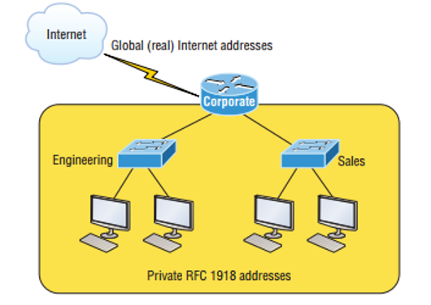
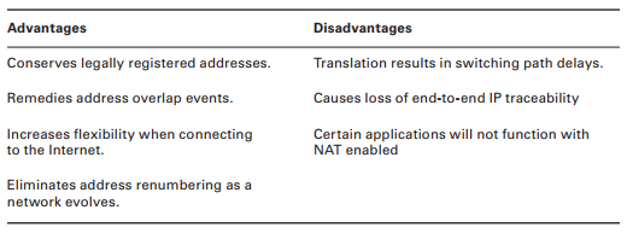
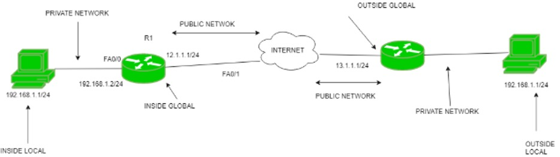
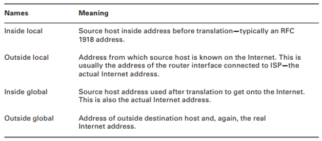
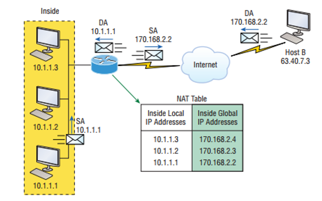
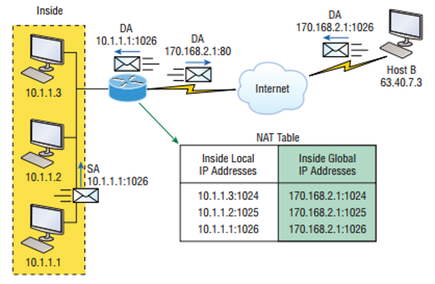
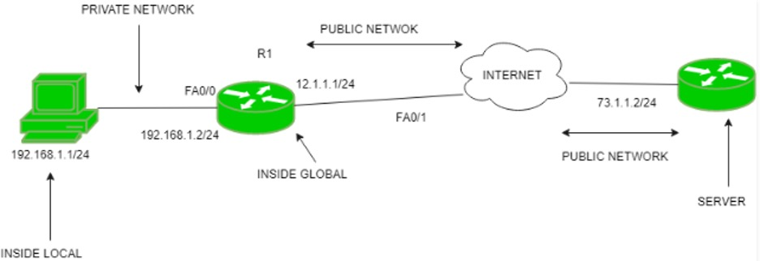
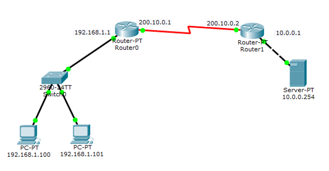

# Module 12: Deployment of SOHO Network

---

## 🧭 Introduction

This module focuses on **Network Address Translation (NAT)** and its role in deploying **SOHO (Small Office/Home Office)** networks.

---

### 🎯 Learning Objectives

By the end of this module, you will be able to:

- ✅ Explain **Network Address Translation (NAT)**
- ✅ Distinguish between the **advantages and disadvantages** of NAT
- ✅ Outline the **different types of NAT**
- ✅ Recognize **important NAT-related terms**
- ✅ Explain how NAT **works**
- ✅ Implement and configure:
  - Static NAT  
  - Dynamic NAT  
  - NAT Overloading (PAT)
- ✅ Explain what a **SOHO network** is
- ✅ **Construct and deploy** a SOHO network using NAT

---

### 🗝️ Key Terms and Concepts

#### 🔳 Wildcard Mask
- An **inverted subnet mask**
- Used to **permit or deny** traffic from a specific IP or network

#### 🏠 SOHO (Small Office Home Office)
- A small network typically with **5–10 users**
- Often uses **NAT** for internet access

#### 🔁 PAT (Port Address Translation)
- A form of **NAT Overloading**
- Allows **multiple private IPs** to share a **single public IP**  
- Uses **port numbers** to keep track of individual sessions

## 🌐 Network Address Translation (NAT)

### 🔎 What is NAT?

**Network Address Translation (NAT)** is the process of translating one or more **local (private) IP addresses** into one or more **global (public) IP addresses** to enable Internet access for internal hosts.

- Only **one public IP** is needed to access the Internet.
- NAT **translates private IPs to public IPs**.
- Private IP addresses are **limited in number**.
- NAT helps **conserve public IP addresses**.

### 🏠 Internal Networking with NAT

- Within a private network, NAT allows the use of **private IP addresses** (e.g., 192.168.x.x).
- These private addresses can be reused by other organizations without conflict.
- NAT handles **translation** when private hosts communicate with external (public) networks.

#### Example:
- Internal device: `192.168.1.10` → Translated by NAT → Public IP: `203.0.113.15`

### 🌍 Role of the Public IP

- Public IPs are **purchased from an ISP**.
- The **router or gateway** uses this IP to represent the internal network.
- The internal host appears to the outside world as the **gateway’s public IP**.

### 🔁 Port Translation

- NAT also translates **port numbers**.
- This allows it to **track sessions** and route return traffic correctly.
- It maintains a **NAT table** for mapping private IPs and ports to public IPs and ports.

### 💡 When is NAT Used?

NAT is essential in many situations:

- Your hosts don’t have **globally unique IPs**
- You need to **merge two intranets** with overlapping IPs
- Your company **switches ISPs** and needs a new IP scheme

---

### 📍 Where NAT Operates

- NAT typically runs on a **border router or firewall**.
- Example: The corporate router connected to the Internet handles NAT.

---

### 📊 Advantages and Disadvantages of NAT

| Advantages                          | Disadvantages                         |
|-------------------------------------|----------------------------------------|
| Conserves public IP addresses       | Can break some end-to-end applications |
| Enhances network security           | Increases complexity                   |
| Allows IP address reuse internally  | May affect performance slightly        |

---

### 🔀 Types of NAT

#### 1. **Static NAT**

- One-to-one mapping between **private and public** IP addresses
- Requires a **public IP for every internal host**
- Used when internal devices need to be **consistently accessible**

#### 2. **Dynamic NAT**

- Maps private IPs to **a pool of public IPs**
- No fixed mapping; **assigns available public IPs as needed**
- Requires enough public IPs for simultaneous connections

#### 3. **NAT Overloading (PAT)**

- Most commonly used
- Maps **multiple private IPs** to **a single public IP**
- Uses **different source ports** to differentiate sessions
- Also known as **Port Address Translation (PAT)**
- Supports thousands of internal hosts with **just one public IP**

---

### 🏷️ NAT Address Terminology

| NAT Term             | Description                                                                 |
|----------------------|-----------------------------------------------------------------------------|
| **Local Address**     | IP address **before** NAT translation                                       |
| **Global Address**    | IP address **after** NAT translation                                        |
| **Inside Local**      | Private IP of internal host                                                 |
| **Inside Global**     | Public IP that represents the internal host to the outside world            |
| **Outside Local**     | IP of the external host as seen from inside the network                     |
| **Outside Global**    | Real IP of the external host                                                |

  

---

Let me know if you'd like the diagrams or figures included as actual images, or if you’d like a downloadable PDF version of this module.

## How NAT Works

Let's explore how Network Address Translation actually works.

---

### Basic NAT Translation

Consider **Figure** (Basic NAT):

- A host with IP **10.1.1.1** sends a packet destined for the Internet.
- The border router, configured with NAT, recognizes this as an **inside local IP address** targeting an outside network.
- The router **translates the source IP address** in the packet to a public IP.
- It then records this mapping in the **NAT table**.
- The packet is forwarded out via the router's **outside interface** with the new **translated source address**.
- When the external host responds, the NAT router uses the NAT table to **translate the inside global IP back** to the inside local IP and deliver it to the internal host.

---

### NAT Overloading (PAT)

Now, look at a more complex scenario with **NAT Overloading** (also known as **Port Address Translation** or PAT), shown in **Figure 5**:

- Multiple inside hosts share **one public IP address**.
- Each inside host is distinguished by its **source port number**.
- For example, an inside host sends an HTTP request (destination port 80) to a web server on the Internet.
- The NAT router modifies the source IP and assigns a **unique source port number** (e.g., 1026).
- When the web server responds, it sends traffic back to the public IP and the assigned port number.
- The router uses the port number to **map the return packet to the correct inside local IP address**.

---

### Why PAT is Important

- Using only IP addresses for translation (like in Static NAT) requires a **public IP for every internal host** — not scalable.
- PAT leverages the **Transport Layer port numbers** to multiplex many private hosts onto a single public IP.
- This allows a single public IP to support up to **65,000 simultaneous connections** by using different port numbers.

---

#### Summary:

| Feature              | Static NAT                    | NAT Overloading (PAT)                  |
|----------------------|------------------------------|---------------------------------------|
| Public IP usage      | One-to-one mapping           | Many-to-one mapping (single IP)       |
| Port translation     | Not used                    | Uses source port to differentiate hosts |
| Scalability          | Limited by number of public IPs | Supports thousands of hosts           |

---

## Static and Dynamic NAT Configuration

---

### Static NAT Configuration

- **Concept:**  
  One private IP address is mapped to one public IP address (one-to-one mapping).  
  Commonly used in **Web hosting** where a server must have a fixed public IP.

- **Topology Example:**  
  - PC IP: `192.168.1.1/24`  
  - Router R1 interfaces:  
    - `fa0/0`: `192.168.1.2/24` (inside interface)  
    - `fa0/1`: `12.1.1.1/24` (outside interface)  
  - Server IP: `73.1.1.2/24`

- **NAT terminology:**  
  - Inside local: Private IP (e.g., PC IP `192.168.1.1`)  
  - Inside global: Public IP (e.g., `12.1.1.2`)

- **Static NAT command:**  
      ip nat inside source static INSIDE_LOCAL_IP_ADDRESS INSIDE_GLOBAL_IP_ADDRESS
      
- **Interface configuration:**  
      R1(config)# interface fa0/0
      R1(config-if)# ip nat inside
      R1(config)# interface fa0/1
      R1(config-if)# ip nat outside

---

### Dynamic NAT Configuration

- **Concept:**  
  Multiple private IP addresses map dynamically to a **pool of public IP addresses**.  
  Useful when a fixed number of users access the Internet simultaneously.

- **Topology Example:**  
  - PC IP: `192.168.1.1/24`  
  - Router R1 interfaces:  
    - `fa0/0`: `192.168.1.2/24` (inside interface)  
    - `fa0/1`: `12.1.1.1/24` (outside interface)  
  - Server IP: `73.1.1.2/24`

- **Configuration Steps:**

  1. **Create Access List to identify inside local IPs:**  
          R1(config)# access-list 1 permit 192.168.1.0 0.0.0.255

  2. **Create NAT pool of public IP addresses:**  
          R1(config)# ip nat pool pool1 12.1.1.1 12.1.1.3 netmask 255.255.255.0

  3. **Assign NAT to inside and outside interfaces:**  
          R1(config)# interface fa0/0
          R1(config-if)# ip nat inside

          R1(config)# interface fa0/1
          R1(config-if)# ip nat outside

  4. **Bind access list and pool to NAT:**  
          R1(config)# ip nat inside source list 1 pool pool1

---

**Summary Table**

| Feature                 | Static NAT                         | Dynamic NAT                         |
|-------------------------|----------------------------------|-----------------------------------|
| Mapping Type            | One-to-one                       | Many-to-pool                      |
| Public IP Requirement   | One per inside host              | Pool of public IPs shared dynamically |
| Use case                | Servers requiring fixed public IP | Multiple users sharing fewer IPs  |
| Configuration complexity | Simple                         | Moderate                         |

---

## NAT Overloading / PAT Configuration and NAT Verification

---

### NAT Overloading / PAT (Port Address Translation) Configuration

- **Concept:**  
  Also known as NAT overload. Many private IP addresses are translated to a **single public IP address**.  
  Port numbers are used to distinguish traffic from different hosts. This is the most common form of NAT because it is cost-effective, allowing thousands of users to share one global IP.

- **Topology Example:**  
  - PC1 IP: `192.168.1.100/24`  
  - PC2 IP: `192.168.1.101/24`  
  - Router0 Interfaces:  
    - `fa0/0`: `192.168.1.1/24` (inside)  
    - `s2/0`: `200.10.0.1` (outside)  
  - Router1 Interfaces:  
    - `fa0/0`: `10.0.0.1/8`  
    - `s2/0`: `200.10.0.2`  
  - Server IP: `10.0.0.254`

- **Routing configuration between Router0 and Router1:**  
      Router0(config)# ip route 0.0.0.0 0.0.0.0 200.10.0.2
      Router1(config)# ip route 0.0.0.0 0.0.0.0 200.10.0.1

- **Access list configuration to define inside local network:**  
      Router0(config)# access-list 1 permit 192.168.1.0 0.0.0.255

- **Enable NAT overloading (PAT) on Router0:**  
      Router0(config)# ip nat inside source list 1 interface s2/0 overload

- **Configure router interfaces for NAT:**  
      Router0(config)# interface fa0/0
      Router0(config-if)# ip nat inside

      Router0(config)# interface s2/0
      Router0(config-if)# ip nat outside

---

### NAT Verification

- **Show active NAT translations:**  
      Router# show ip nat translations

  *Note:* You may see multiple translations from the same host to the destination host. This is normal with many simultaneous connections.

- **Enable NAT debugging (to view translation process):**  
      Router# debug ip nat

  This command shows sending address, translation details, and destination addresses for each packet processed.

- **Clear NAT translation entries:**  
  - Clear a specific translation:  
        Router# clear ip nat translation [translation-id]

  - Clear all NAT translations (use with caution):  
        Router# clear ip nat translation *

---
