# Module 13: Network application using sockets

# Introduction

Module 13 will discuss the client-server model, ports and sockets, and network applications using sockets.

---

## Learning Objectives

By the end of this module, you should be able to complete the following:

- Explain concepts of the client-server model.
- Identify client-server roles and communications.
- Distinguish between the advantages and disadvantages of client-server communication.
- Explain ports and sockets, and their functions in network communication.
- Outline TCP and UDP and identify socket address structure.
- Interpret the sequence of function calls for the client and a server participating in a TCP connection.

---

## Key Terms and Concepts

- **API**  
  Application Programming Interface is a computing interface to a software component or a system that defines how other components or systems can use it.

- **DOS attack**  
  Denial Of Service attacks are designed to exploit a server's obligation to process requests by overloading it with excessive request rates.

- **Sockets**  
  IP address + Port number

## Client-Server Model

The client-server model is a widely used communication paradigm in networking. It divides tasks between resource providers (servers) and service requesters (clients). Typically, clients and servers run on separate hardware connected over a network, but both can also reside on the same system. Servers run programs that share resources, while clients request content or services. Clients initiate communication sessions, and servers respond. Common examples include Email, network printing, and the World Wide Web.

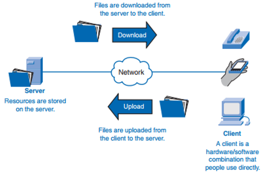

---

### Client and Server Roles

The model defines the relationship between cooperating programs. Servers provide functions or services to one or many clients, which initiate requests. Servers are classified by their service type—for example, web servers serve web pages, file servers serve files. Server resources can include software, data, processors, and storage.

A computer can act as client, server, or both, depending on the application. Multiple server programs can run on the same machine serving different clients. Servers may also communicate with each other (server-to-server communication).

---

### Client and Server Communication

Clients do not need to know how a server processes requests, only how to interpret the response according to the application protocol.

Communication follows a request–response messaging pattern: the client sends a request, and the server replies. This inter-process communication requires a common protocol to define message formats and rules.

Servers may implement APIs to standardize and simplify access to services, enabling cross-platform compatibility.

Servers handle multiple client requests using scheduling. To maintain availability and prevent abuse (e.g., denial-of-service attacks), servers may limit client access and use encryption for sensitive data.

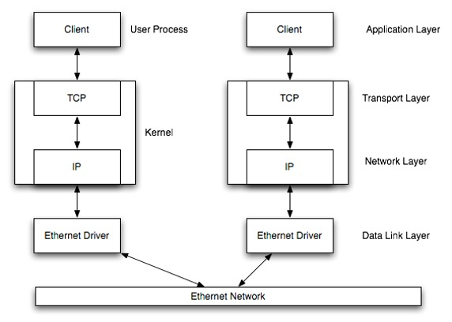

Clients and servers can be on different LANs connected via WANs or the Internet.

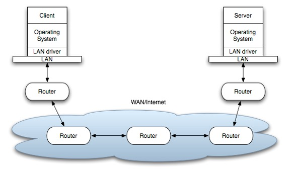

Data flows down the protocol stack on the sender side, across the network, and up the stack on the receiver side.

---

### Client-Host and Server-Host

A *host* is any computer connected to a network. While "client" and "server" may refer to software, "client-host" and "server-host" always mean physical computers. Servers tend to be dedicated machines for serving resources.

---

### Servers

Servers respond to client requests by providing shared resources such as web pages, documents, databases, and multimedia files. For instance, print servers manage client print jobs.

Server access can require user authentication and permissions to control data or operation access.

Servers run background processes called daemons that listen for and handle client requests, exchanging messages according to protocols.

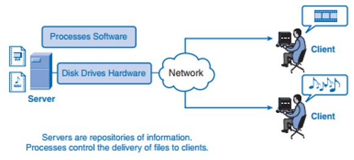

---

### Advantages and Disadvantages

**Advantages:**  
- Centralized control improves data protection and security enforcement.  
- Platform-independent communication enables clients and servers on different operating systems.

**Disadvantages:**  
- Server overload from too many simultaneous client requests can cause delays, network congestion, or denial of service.

## Ports and Sockets

On a TCP/IP network, every device has a unique IP address identifying the device (e.g., a computer). However, an IP address alone is not enough for running multiple network applications or services simultaneously on the same device. 

### Ports

Network **ports** identify specific applications or services running on a computer. By using ports, a single device can run multiple services at the same time, each distinguished by a unique port number.

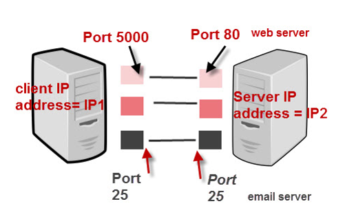

---

### Sockets

A **socket** is one endpoint of a two-way communication link between two programs on a network. It consists of an IP address combined with a port number, which allows the TCP layer to direct data to the correct application.

Each TCP connection is uniquely identified by the pair of sockets at its endpoints (client and server).

#### Example

Imagine you are on your PC with two browser windows open: one browsing Google, the other Yahoo.

- Connection to Google:  
  - Client socket: Your PC IP + port 60200  
  - Server socket: Google IP + port 80 (HTTP standard port)  

- Connection to Yahoo:  
  - Client socket: Your PC IP + port 60401  
  - Server socket: Yahoo IP + port 80  

---

### Server and Client Socket Behavior

A server listens on a specific socket (IP + port) waiting for client connection requests.

On the client side, the client knows the server’s hostname and listening port. To connect, the client binds to a local port (usually assigned automatically) and sends a connection request to the server’s socket.

If the server accepts the connection, it creates a new socket for communicating with that client, while continuing to listen on the original socket for new requests.

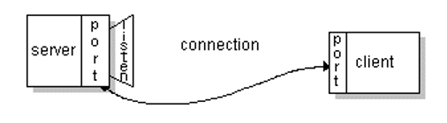

---

## UDP and TCP

### User Datagram Protocol (UDP)

UDP is a simple transport-layer protocol where an application writes a message to a UDP socket. This message is encapsulated into a UDP datagram, which is then wrapped inside an IP datagram and sent to the destination.

- **Connection-less:** No connection is established between client and server.
- **No reliability guarantees:**  
  - No guarantee datagrams reach the destination.  
  - No guarantee datagrams arrive in order.  
  - No automatic retransmission if datagrams are lost or corrupted (detected via checksum).  
- Each UDP datagram includes its length, which is passed to the receiving application along with the data.

---

### Transmission Control Protocol (TCP)

TCP is a connection-oriented transport protocol, establishing a connection between client and server before data transfer.

- **Reliability:**  
  - Requires acknowledgments for data sent.  
  - Retransmits data if acknowledgments are not received within a timeout period.  
- **Stream-based:** TCP is a byte-stream protocol with no inherent message boundaries, unlike UDP’s message-based datagrams.

---

## Socket Addresses

### IPv4 Socket Address Structure

The IPv4 socket address structure is named `sockaddr_in` and is defined in the `<netinet/in.h>` header.

The POSIX definition includes:

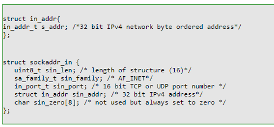

- `uint8_t` is an unsigned 8-bit integer used for certain fields.

---

### Generic Socket Address Structure

Socket address structures are always passed by reference to socket functions. These functions must handle socket addresses from any supported protocol family.

To handle the different protocol families uniformly, a generic socket address structure is used. Because the socket functions predate ANSI C’s introduction of the `void *` type, the generic socket address structure was defined as follows:

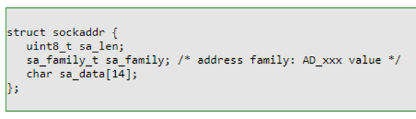

## Host Byte Order and Network Byte Order Conversion

There are two ways to store multi-byte values in memory:

- **Little-endian byte order:** The lower-order byte is stored at the starting address.
- **Big-endian byte order:** The higher-order byte is stored at the starting address.

These are collectively referred to as **host byte order** because they depend on the architecture of the host machine.

For example:
- An **Intel processor** (little-endian) stores a 32-bit integer as four consecutive bytes in memory in the order: 1-2-3-4, where `1` is the **least** significant byte.
- An **IBM PowerPC processor** (big-endian) stores the integer in the byte order: 4-3-2-1.

Networking protocols such as TCP/IP use a specific **network byte order**, which is **big-endian**.

---

### The `htons()`, `htonl()`, `ntohs()`, and `ntohl()` Functions

These functions convert values between host byte order and network byte order:

| Function  | Description                                 | Converts to       | Data Size      |
|-----------|---------------------------------------------|-------------------|----------------|
| `htons()` | Host to Network Short                       | Network byte order | 16 bits (short)|
| `htonl()` | Host to Network Long                        | Network byte order | 32 bits (long) |
| `ntohs()` | Network to Host Short                       | Host byte order    | 16 bits (short)|
| `ntohl()` | Network to Host Long                        | Host byte order    | 32 bits (long) |

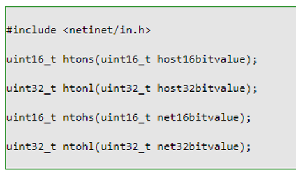

## TCP Socket API

A **TCP socket** is an endpoint instance defined by an IP address and a port in the context of either a particular TCP connection or the listening state. A port is a virtualization identifier defining a service endpoint (as distinct from a service instance endpoint aka session identifier).

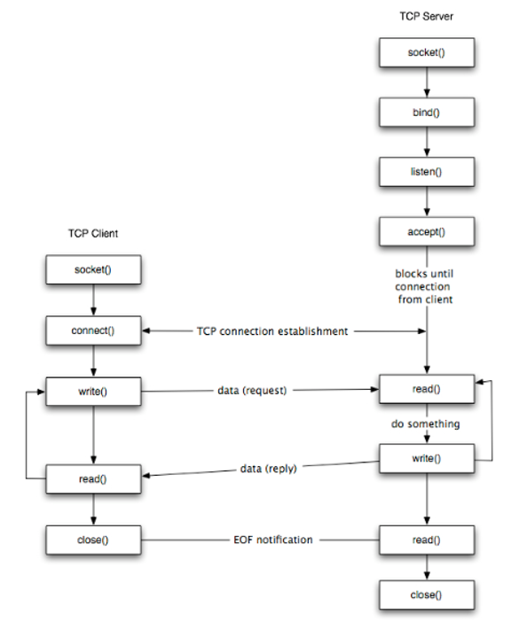

---

### TCP Connection Sequence

#### Client Side Steps:

1. Create a socket using the `socket()` function;
2. Connect the socket to the server address using the `connect()` function;
3. Send and receive data by means of the `read()` and `write()` functions;
4. Close the connection using the `close()` function.

#### Server Side Steps:

1. Create a socket with the `socket()` function;
2. Bind the socket to an address using the `bind()` function;
3. Listen for connections with the `listen()` function;
4. Accept a connection with the `accept()` function call (this typically blocks until a client connects);
5. Send and receive data by means of `send()` and `recv()`;
6. Close the connection using the `close()` function.

---

### Important Functions

#### socket()

    int socket(int family, int type, int protocol);

- **family:** Protocol family (e.g., `AF_INET` for IPv4)
- **type:** Socket type (e.g., `SOCK_STREAM` for TCP, `SOCK_DGRAM` for UDP)
- **protocol:** Usually `0` (default)
- Returns a non-negative socket descriptor on success or `-1` on error.

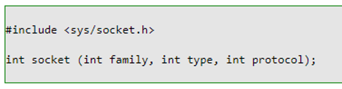

---

#### connect()

    int connect(int sockfd, const struct sockaddr *addr, socklen_t addrlen);

- **sockfd:** Socket descriptor returned by `socket()`
- Returns `0` if connection succeeds (TCP handshake done), or `-1` on error.
- Client usually does not call `bind()` before this; the OS assigns ephemeral port and source IP.

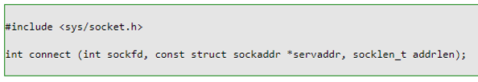

---

#### bind()

    int bind(int sockfd, const struct sockaddr *addr, socklen_t addrlen);

- Assigns a local address (IP + port) to a socket.
- Returns `0` on success, `-1` on error.
- Requires casting to `(struct sockaddr *)` for address parameter.

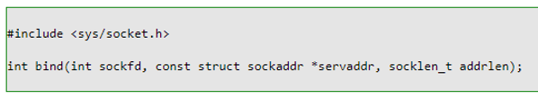

Example for IPv4:

    struct sockaddr_in servaddr;
    // initialize servaddr ...
    bind(sockfd, (struct sockaddr *)&servaddr, sizeof(servaddr));

---

#### listen()

    int listen(int sockfd, int backlog);

- Converts the socket to a passive socket to accept connections.
- **backlog:** Max number of queued connections.
- Returns `0` on success, `-1` on error.

---

#### accept()

    int accept(int sockfd, struct sockaddr *addr, socklen_t *addrlen);

- Accepts a pending connection request.
- Returns a new connected socket descriptor or `-1` on error.
- `addr` and `addrlen` receive client address info, or can be `NULL`.

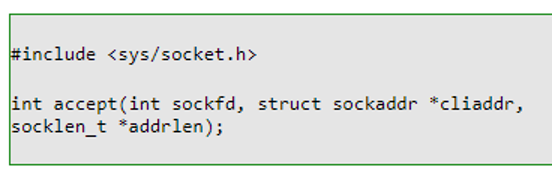

---

#### send()

    ssize_t send(int sockfd, const void *buf, size_t len, int flags);

- Sends data on a connected socket.
- Returns number of bytes sent or `-1` on error.
- `flags` is usually `0`.

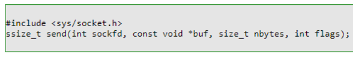

---

#### recv()

    ssize_t recv(int sockfd, void *buf, size_t len, int flags);

- Receives data from a connected socket.
- Returns number of bytes received, `0` if connection closed, or `-1` on error.
- `flags` is usually `0`.

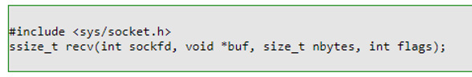

---

#### close()

    int close(int sockfd);

- Closes the socket.
- Returns `0` on success, `-1` on error.

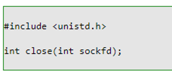

---

### Notes on Binding Addresses (IPv4)

| IP Address          | Port           | Effect                                        |
|---------------------|----------------|-----------------------------------------------|
| Specific IP         | Specific port  | Bind to that IP and port                       |
| Specific IP         | 0              | Bind to IP, any available port                 |
| 0.0.0.0 (INADDR_ANY) | Specific port | Bind to all interfaces on that port            |
| 0.0.0.0             | 0              | Bind to all interfaces and ephemeral port     |

Localhost address is `127.0.0.1` for local connections.

---

### TCP Echo Client

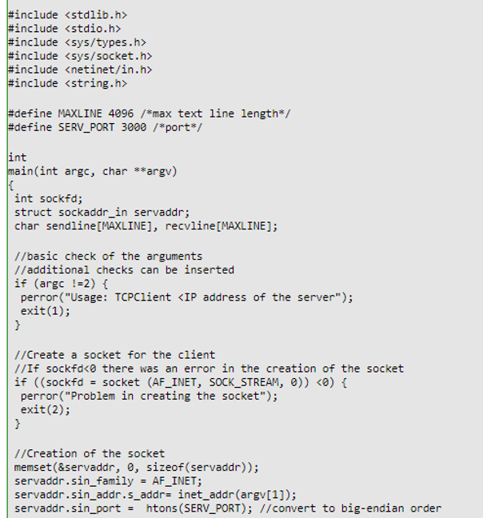

### TCP Echo Client

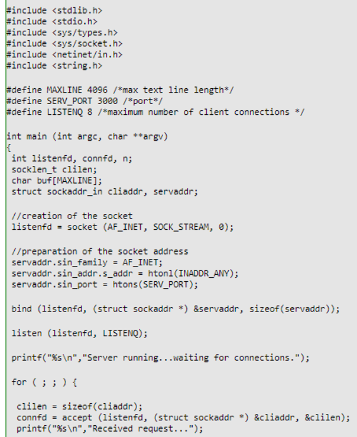
