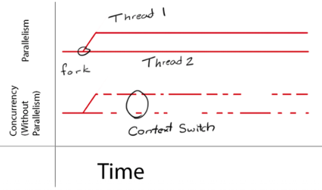
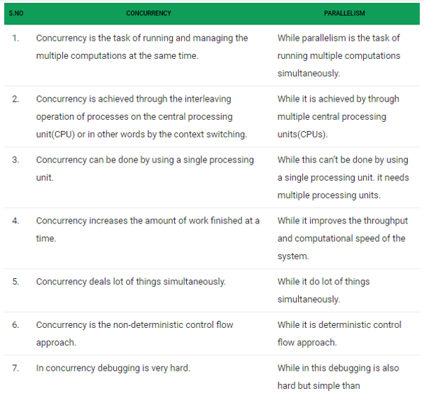
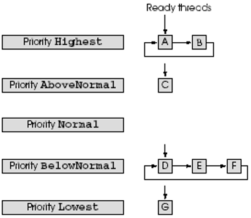
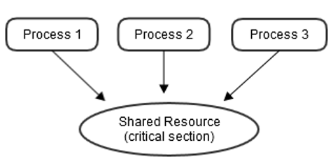
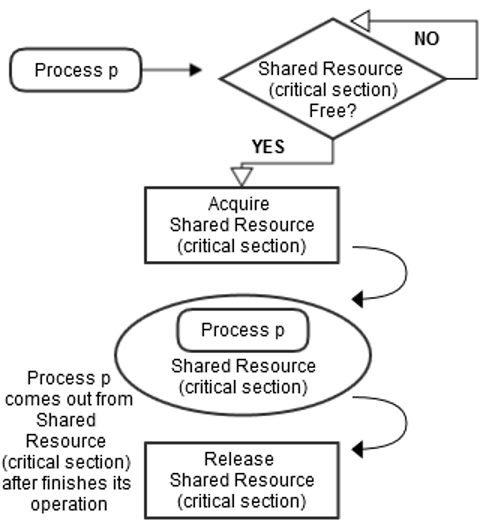
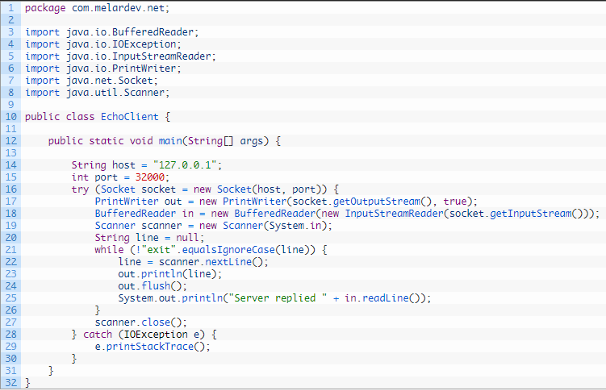
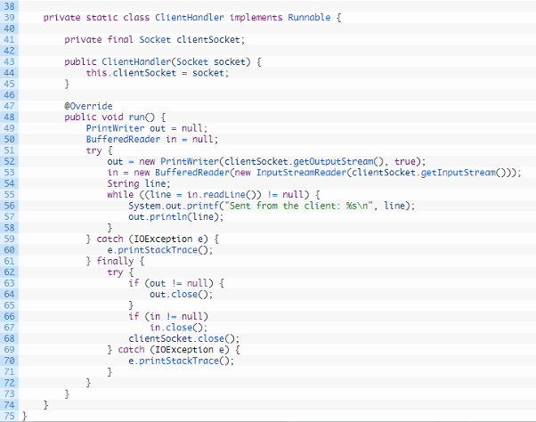

# Module 14: Multithreading Concepts to a Client/Server Program

## Introduction

The last and final module of this course will discuss multithreading concepts in Client/Server programming.

---

### Learning Objectives

By the end of this module, you should be able to complete the following:

- Explain the concepts of **program**, **process**, and **thread**.
- Distinguish between **process** and **thread**.
- Identify the advantages of **threads** and **multithreading**.
- Outline the different types of threads and differentiate between them.
- Explain **concurrency** and **parallelism** concepts and compare them.
- Interpret **thread priorities** and **thread scheduling**.
- Explain **thread synchronization** concept.
- Interpret the multithreading concept in client-server programs.

---

### Key Terms and Concepts

#### Concurrency  
Concurrency means that an application is making progress on more than one task at the same time (concurrently).

#### Parallelism  
Parallelism means that an application splits its tasks up into smaller subtasks, which can be processed in parallel.

#### Thread  
Smallest executable unit of a process.

#### Throughput  
Throughput is the rate of production or the rate at which something is processed. When used in the context of communication networks, such as Ethernet or packet radio, throughput or network throughput is the rate of successful message delivery over a communication channel.

## Program, Process, and Thread - Summary

### Program
- A set of ordered instructions to perform a task (e.g., `chrome.exe`).
- Passive entity, stored on disk.

### Process
- An executing instance of a program.
- Contains program code and activity, can have one or multiple threads.
- Multiple processes can run the same program independently.

### Thread
- Smallest executable unit within a process.
- Has its own program counter, registers, and stack.
- Shares code, data, and files with peer threads in the same process.
- Enables concurrency and parallelism within a process.
- CPU executes one thread at a time using time slices.

### Differences: Process vs Thread
- Processes have separate memory; threads share memory within the same process.
- Processes are heavier to create and manage than threads.

### Advantages of Threads
- Lower context switching overhead than processes.
- Better resource sharing and communication.
- Enables efficient use of multiprocessor systems.

### Types of Threads
- **User-Level Threads:** Managed by a user-level library, fast but can’t utilize multiple CPUs well.
- **Kernel-Level Threads:** Managed by the OS kernel, slower but can run truly concurrently on multiple CPUs.

### Multithreading
- Improves application throughput and responsiveness.
- Allows parallel execution on multi-core CPUs.
- Needs careful design to avoid complexity and overhead.

## Concurrency vs Parallelism

### Concurrency
- Multiple tasks **make progress at the same time**, but not necessarily simultaneously.
- Achieved via **context switching** (especially on single-core CPUs).
- **Illusion** of parallelism.
- Focus: **Managing multiple tasks** effectively.
- Requires handling **shared resources** with synchronization (e.g., locks, semaphores).
- Example: One CPU switches between tasks A and B quickly.

### Parallelism
- Tasks or subtasks are **executed simultaneously** on multiple cores/CPUs.
- True parallel execution using **multi-core hardware**.
- Focus: **Executing tasks faster** by dividing them.
- Requires **multiple threads or processes** running on different cores.
- Example: Task A split into subtasks A1 and A2, processed at the same time.

### Key Differences

| Feature            | Concurrency                         | Parallelism                          |
|--------------------|--------------------------------------|--------------------------------------|
| Definition         | Managing many tasks at once         | Executing many tasks at once         |
| Execution          | Interleaved                          | Simultaneous                         |
| Hardware Needed    | Not necessarily multi-core          | Requires multi-core/multi-CPU        |
| Use Case           | Responsiveness, resource sharing     | Performance, speed-up                |
| Can Occur Together | Yes                                  | Yes                                  |

### Combinations

- **Concurrent, not parallel**: Single-core CPU handling multiple tasks via switching.
- **Parallel, not concurrent**: One task split into parallel subtasks, one at a time.
- **Both**: Multiple tasks, each split and run in parallel.
- **Neither**: One task processed start to finish, no splitting or switching.

## Thread Priorities and Thread Scheduling

Every thread has a priority in the range between **ThreadPriority.Lowest** to **ThreadPriority.Highest**. These two values come from the `ThreadPriority` enumeration (namespace `System.Threading`). The enumeration consists of the values:

- `Lowest`
- `BelowNormal`
- `Normal`
- `AboveNormal`
- `Highest`

By default, each thread has priority `Normal`.

---

The Windows operating system supports a concept called **time slicing**, which allows threads of equal priority to share a processor. Without time slicing, each thread in a set of equal-priority threads runs to completion (unless the thread leaves the `Running` state and enters the `Wait`, `Sleep`, `Join`, `Suspended`, or `Blocked` state) before the other threads get a chance to execute.

With time slicing, each thread receives a brief burst of processor time, called a **quantum**, during which the thread can execute. At the end of its quantum, even if the thread has not finished executing, the processor is taken away and given to the next thread of equal priority (if available).

---

The job of the **thread scheduler** is to:

- Keep the highest-priority thread running at all times
- Time-slice among threads of equal highest priority in a **round-robin** fashion

---

Assuming a single-processor system:

- Threads **A** and **B** execute in round-robin fashion until both complete.
- Thread **C** runs to completion.
- Threads **D**, **E**, and **F** execute in round-robin fashion until complete.

**Starvation**: If new higher-priority threads continuously enter the system, they may indefinitely postpone lower-priority threads from executing.

---

A thread’s priority can be adjusted using its `Priority` property, which accepts values from the `ThreadPriority` enumeration. If an invalid value is supplied, an `ArgumentException` occurs.

A thread executes until it:

- Dies
- Is **Blocked** for I/O
- Calls **Sleep**
- Calls `Monitor.Wait` or `Join`
- Is **preempted** by a higher-priority thread
- Its quantum **expires**

A higher-priority thread may become `Started` and preempt a currently running thread when:

- A **sleeping** thread wakes up
- I/O completes for a blocked thread
- `Pulse` or `PulseAll` is called on an object that was waited on
- A `Join`ed thread completes

---

## Figure 11: Threads Sleeping and Printing

This example demonstrates:

- Construction of a `Thread` object
- Use of the `Thread.Sleep` method

The program creates **three threads**, each with default priority `Normal`. Each thread:

1. Prints a message that it is going to sleep for a random interval (0–5000 ms)
2. Goes to sleep
3. Wakes up
4. Prints a completion message
5. Terminates and enters the `Stopped` state

The `Main` thread will terminate **before** the entire application does, because the other threads are still alive.

---

### Code Structure

- **`MessagePrinter` class** (lines 44–73)
  - Controls the lifecycle of each thread
  - Has an instance variable `sleepTime`
  - Has a static `Random` object
  - Constructor initializes `sleepTime` to a random value between 0–5000 ms
  - `Print()` method:
    - Gets the current thread using `Thread.CurrentThread`
    - Displays thread name and sleep duration
    - Calls `Thread.Sleep(sleepTime)`
    - Wakes up and prints completion message

- **`ThreadTester` class** (lines 8–41)
  - Creates 3 `MessagePrinter` objects
  - Creates 3 `Thread` objects using `ThreadStart` delegates that point to the respective `Print` methods
  - Sets each thread’s `Name`
  - Calls `Start()` on each thread
  - Main thread prints a message and terminates

Each thread begins execution by invoking its associated `Print()` method. The application ends when the **last thread** reaches the `Stopped` state.

## Thread Synchronization

Thread synchronization is defined as a mechanism which ensures that two or more concurrent processes or threads do not simultaneously execute some particular program segment known as the **critical section**. Processes' access to the critical section is controlled by using synchronization techniques. When one thread starts executing the critical section (serialized segment of the program), the other threads should wait until the first thread finishes. If proper synchronization techniques are not applied, it may cause a **race condition** where the values of variables may be unpredictable and vary depending on the timings of context switches of the processes or threads.

---

---

For example, suppose there are three processes, namely 1, 2, and 3. All three of them are concurrently executing, and they need to share a common resource (critical section) as shown in **Figure 13**. Synchronization should be used here to avoid any conflicts for accessing this shared resource. Hence, when Process 1 and 2 both try to access that resource, it should be assigned to only one process at a time. If it is assigned to Process 1, the other process (Process 2) needs to wait until Process 1 frees that resource (as shown in **Figure 13**).

---

---

Another synchronization requirement which needs to be considered is the order in which particular processes or threads should be executed. For example, one cannot check e-mails before validating the appropriate credentials (for example, user name and password). In the same way, an ATM will not provide any service until it receives a correct PIN.

---

Other than mutual exclusion, synchronization also deals with the following:

- **Deadlock**, which occurs when many processes are waiting for a shared resource (critical section) which is being held by some other process. In this case, the processes just keep waiting and execute no further.
- **Starvation**, which occurs when a process is waiting to enter the critical section, but other processes monopolize the critical section, and the first process is forced to wait indefinitely.
- **Priority inversion**, which occurs when a high-priority process is in the critical section, and it is interrupted by a medium-priority process. This violation of priority rules can happen under certain circumstances and may lead to serious consequences in real-time systems.
- **Busy waiting**, which occurs when a process frequently polls to determine if it has access to a critical section. This frequent polling robs processing time from other processes.

---

A single processor or uniprocessor system could disable interrupts by executing current running code without preemption, which is very inefficient on multiprocessor systems. The key ability we require to implement synchronization in a multiprocessor is a set of hardware primitives with the ability to **atomically read and modify a memory location**. Without such a capability, the cost of building basic synchronization primitives will be too high and will increase as the processor count increases.

There are a number of alternative formulations of the basic hardware primitives, all of which provide the ability to atomically read and modify a location, together with some way to tell if the read and write were performed atomically. These hardware primitives are the basic building blocks that are used to build a wide variety of user-level synchronization operations, including things such as locks and barriers.

In general, architects do not expect users to employ the basic hardware primitives, but instead expect that the primitives will be used by system programmers to build a synchronization library, a process that is often complex and tricky.

Many modern hardware provides special atomic hardware instructions by either **test-and-set** the memory word or **compare-and-swap** contents of two memory words.

## Multithreading in Client-Server Program

Socket programming helps to connect a client to a server. The client is a message sender and receiver, while the server is just a listener that works on data sent by the client.

**Multithreading** is a process of executing multiple threads simultaneously in a single process.

Now, let’s see the following client-server multithreading socket programming by code:

---

### The Client Code

---

### The Server Code

